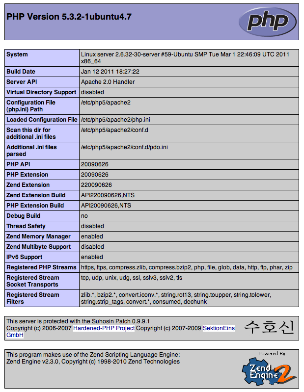
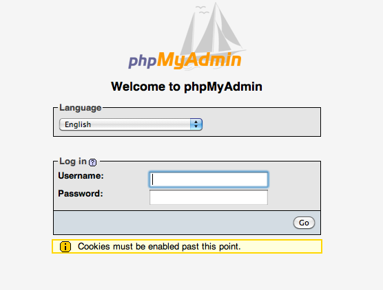

Dienste
=======

Fernwartung - SSH
-----------------

Da ein Server in der Regel nicht über Monitor, Tastatur und Maus
verfügt, sollte er zuerst eine Möglichkeit zur Fernwartung
bekommen. Die einfachste und gleichzeitig eine der sichersten
Methoden zur Fernwartung ist der
`SSH <http://de.wikipedia.org/wiki/Ssh>`_-Server. Durch die
verschlüsselte SSH-Verbindung bleiben alle Eingaben, wie Passwörter
und dergleichen von außen unsichtbar. Bei der Installation des
Servers wird außerdem ein einzigartiger Schlüssel erstellt, mit dem
sich der Server beim Client ausweisen kann. So wird ausgeschlossen, dass
jemand vorspielt unser Server zu sein und sich auf
diesem Weg unser Passwort und anschließend unseren Server an zueignen.

Um den Server zu installieren reicht ein

::

    $ sudo apt-get install openssh-server

Die Installation dauert je nach System ein wenig, da die Schlüssel
generiert werden müssen. Anschließend kann von einem anderen Rechner
im Netzwerk per SSH-Client auf das System zugegriffen werden. Unter
Linux geht das auf der Konsole mit

::

    $ ssh benutzer@192.168.0.254 

wobei die Adresse mit der des Servers entsprechen sollte. Unter Windows sei das
Programm `Putty <http://www.chiark.greenend.org.uk/~sgtatham/putty/>`_ zum
Herstellen einer SSH-Verbindung empfohlen. Jetzt kann man den Server ohne
Tastatur und Monitor in eine Ecke verbannen, denn ab sofort kann er bequem vom
Desktop-Rechner aus bedient werden.

Einfacher und sicherer Login mit Keys
~~~~~~~~~~~~~~~~~~~~~~~~~~~~~~~~~~~~~

Eine etwas komfortablere und auch sicherere Methode sich dem Server gegenüber
zu Authentifizieren ist der Login über eine Schlüsseldatei. Dazu wird auf dem
Client-Rechner ein Schlüssel generiert und dem Server mitgeteilt, dass er den
Client mit diesem Schlüssel ohne Passwort-Eingabe passieren lässt.

Zur Erstellung des Schlüssels genügt unter Linux folgender Befehl::

    $ ssh-keygen -t dsa

In der Standardeinstellung wird dieser automatisch in der Datei
**/home/benutzer/.ssh/id_dsa** abgelegt. Diese Datei sollte unter allen
Umständen geheim gehalten werden (man gibt ja auch nicht jedem seinen
Haustürschlüssel in die Hand). Zusätzlich wird im gleichen Verzeichnis eine
Datei **id_dsa.pub** erstellt. Der Inhalt dieser Datei ist der öffentliche
Schlüssel, der dem Server bekannt gemacht werden muss um den Client zu erkennen.
Um den Public-Key auf den Server zu kopieren gibt es das Tool **ssh-copy-id**::

    $ ssh-copy-id -i ~/.ssh/id_dsa.pub benutzer@192.168.0.254

Dies führt dazu das der Inhalt der Datei **id_dsa.pub** auf dem *Server* in die
Datei **/home/benutzer/.ssh/authorized_keys** eintragen wird. Danach sollte man
Testen ob man beim Verbinden nach dem Passwort gefragt wird. Wenn nicht, hat
der Transfer geklappt, falls man dennoch nach dem Passwort gefragt wird, sollte
man den Inhalt der Datei **id_dsa.pub** manuell in die oben genannte Datei
eintragen (Falls die Datei nicht existiert, bitte anlegen).

.. todo:: Vorgehen für Putty

Fileserver
----------

Samba - Dateifreigabe im Windows-Netz
~~~~~~~~~~~~~~~~~~~~~~~~~~~~~~~~~~~~~

Klingt erstmal wie ein äußerst spannender Thriller, ist aber in
Wirklichkeit eine total harmlose Freigabe von Verzeichnissen im
Netzwerk. Und das so, dass auch Windows-Rechner darauf zugreifen
können.
Dafür wird der sogenannte Samba-Server installiert:

::

    $ sudo apt-get install samba

Samba - Benutzerverwaltung
__________________________

Bevor sich ein Benutzer am Samba-Server anmelden kann muss er
zuerst mit diesem bekannt gemacht werden. Dazu dient das folgende
Kommando:

::

  sudo smbpasswd -a benutzer

Anschließend wird zur Passwortvergabe aufgefordert. Falls das
Passwort des Benutzers im System irgendwann einmal geändert werden
sollte wird später in der Konfiguration des Servers vermerkt, dass die
Passwörter zwischen System und Samba ab geglichen werden. Der obige Schritt
muss also nur einmal erfolgen.

Konfiguration
_____________

Die Konfiguration von Samba geschieht vollständig in der Datei
**/etc/samba/smb.conf**.Es besteht bereits eine Beispiel-Datei, die
wir aber hier nicht verwenden werden, sondern erst einmal aus dem
Weg schaffen:

::

  sudo mv /etc/samba/smb.conf /etc/samba/smb.conf.bak

Anschließend erstellt man die Datei mit dem Editor neu:

::

  sudo nano /etc/samba/smb.conf

Die Datei ist der Übersichtlichkeit halber in Sektionen unterteilt,
in der Regel gilt das eine Sektion einer Freigabe entspricht und
der Name der Sektion der Name der späteren Freigabe ist. Wenn also
die Sektion ``[freigabe]`` heißt (die eckigen Klammern umschließen den
Sektionsnamen), dann würde die Freigabe entsprechend 'freigabe'
heißen. Es gibt allerdings einige bereits festgelegte
Sektionsnamen, die man nicht für seine eigenen Freigaben verwenden
sollte. Dazu gehört unter anderen auch die Sektion ``[global]``, die
für die Allgemeinen Einstellungen des Server reserviert ist und mit
der die Konfigurationsdatei 'smb.conf' in der Regel beginnt:

::

    [global]
    workgroup = ARBEITSGRUPPE
    server string = Samba Server auf %h
    wins support = yes
    os level = 33
    local master = yes
    ;wins server = w.x.y.z
    unix password sync = yes
    passwd program = /usr/bin/passwd %u

Für einfaches Filesharing ist das schon genug der Einstellung. Die
Zeile 'wins support' sollte falls man einen Windows-Server im
Netzwerk betreibt auf 'no' gesetzt werden und die Zeilen 'os level
= 33' und 'local master = yes' gelöscht oder mit ';' auskommentiert
werden. Dafür sollte die Zeile ';wins server = w.x.y.z' wiefolgt
abgeändert werden:

::

    wins server = 192.168.0.250

Wobei ``192.168.0.250`` die IP des Windows-Servers ist.
Wozu dient WINS? Ganz einfach dazu, die IP-Adressen der im Netzwerk
vorhandenen Rechner deren NETBIOS-Namen, also den Hostnamen
zuzuweisen und anderen Rechnern ein Verzeichnis zu bieten, in der
diese die Zuordnung (IP<>Hostname) nachschauen können.
Die letzten beiden Zeilen sorgen dafür, dass, wie eben
angesprochen, die Benutzerpasswörter des Systems mit denen des
Samba-Servers ab geglichen werden.
Als nächstes richten wir eine einfache Freigabe ein, zu der jeder
der eingerichteten Nutzer Zugriff hat. Dazu legen wir eine neue
Sektion an mit dem Namen 'public'. Zuerst erstellen wir allerdings
das Verzeichnis und setzen die Benutzerrechte so, das die Benutzer
der Gruppe 'users', darauf zugreifen können:

::

  sudo mkdir /srv/public
  sudo chmod o-rwx /srv/public
  sudo chgrp users /srv/public
  sudo chmod g+sw /srv/public

Zeile 1 legt das Verzeichnis (das Überverzeichnis **/srv** ist für
solche Serverdienste reserviert, also nutzen wir das hier auch mal)
an, Zeile zwei beschränkt die Lese- und Schreibrechte auf Besitzer
und Gruppe des Verzeichnisses, Zeile 3 ändert die Gruppe des
Verzeichnisses auf **users** und Zeile 4 sorgt dafür das neu
angelegte Verzeichnisse immer der Gruppe **users** gehören. (mehr zum
Thema Rechte unter http://wiki.ubuntuusers.de/Rechte)

Dann wird die Freigabe in die ``smb.conf`` eingetragen:

::

    [public]
    comment = Freigabe fuer jedermann
    path = /srv/public
    writeable = yes
    valid users = @users
    force directory mode = 660
    force create mode = 660

In der Zeile comment gibt man am besten eine Beschreibung des
Verzeichnisses an (kann auch weggelassen werden), in der Zeile path
gibt man den Pfad zum eben angelegten Verzeichnis an. *writeable*
sorgt dafür das das Schreiben in das Verzeichnis möglich ist. Die
letzten drei Zeilen sind für die Zugriffsrechte zuständig: *valid
users* zeigt hier an das die Gruppe *users*, deutlich gemacht durch
das @, Zugriff hat. Einzelne Benutzer werden ohne @ durch Komma
getrennt eingetragen. Die anderen beiden Zeilen sorgen dafür, das
neu angelegte Dateien und Verzeichnisse von den Benutzern der
Gruppe *users* Les- und Schreibbar sind.

Damit können wir unseren Server auch schon testen, ``smb.conf``
abspeichern und mit ``testparm -v`` prüfen ob die gemachten
Konfigurationen Fehler enthalten. Das Konsolenprogramm gibt die
komplette Konfiguration aus und zeigt eventuelle Fehler an. Wenn
die Einstellungen fehlerfrei sind, wird der Server mit ``sudo
service samba restart``, neu gestartet. Danach sollte man testen
ob die Freigabe aus dem Netzwerk erreichbar ist. Dazu einfach mit
einem geeigneten Client (Linux, Windows, Mac) versuchen auf die
Freigabe zuzugreifen. Dabei sollte der eingerichtete Benutzer und
dessen Passwort abgefragt werden.

WebDAV
~~~~~~

WebDAV ist ein sehr nützlicher Standard zur
Bereitstellung von Daten in Netzwerken, da er die Standard
HTTP-Ports verwendet und so meist auch funktioniert wenn der Client
hinter einer Firewall sitzt. Zudem müssen bei bereits aktivem
Webserver keine weiteren Ports freigegeben werden (für FTP oder
SSH) um die Dateien auf dem Server zu bearbeiten. Mehr
Informationen zu WebDAV unter http://de.wikipedia.org/wiki/Webdav.

Da WebDAV eine Implementierung des HTTP Protokolls ist, benötigen
wir einen Webserver wie zum Beispiel den Apache (Einrichtung siehe
Abschnitt lamp auf Seite {lamp}). Ist dieser installiert muss nur
das Modul für WebDAV geladen werden und anschließend Apache neu
gestartet werden:

::

  sudo a2enmod dav
  sudo a2enmod dav_fs

Um die Einrichtung der Benutzer zu vereinfachen wird hier das Modul
*auth_pam* verwendet. Damit können alle Benutzer, die über
*adduser* (siehe Abschnitt :ref:`Benutzer und Gruppen <usergroups>`)
eingerichtet werden Zugriff per WebDAV
bekommen. 

::

  sudo apt-get install libapache2-mod-auth-pam
  sudo a2enmod auth_pam

Um auf unser *public*-Verzeichnis zugreifen zu muss zunächst der
Benutzer der den Apache-Server lädt in die Gruppe *users*
aufgenommen werden:

::

  sudo adduser www-data users

Zusätzlich muss der Benutzer Mitglied der Gruppe *shadow* sein um
auf die System-Benutzer-Datenbank zugreifen zu können:

::

  sudo adduser www-data shadow

Um schlussendlich Zugang zu den Daten zu erhalten muss die Datei
``/etc/apache2/sites-available/default`` bearbeitet werden. Am Ende
der Datei, aber vor der Zeile ``</Virtualhost>`` wird folgender
Abschnitt eingefügt:

.. todo:: eigene Datei für DAV-host

::

    Alias /public "/srv/public/"
    <Directory "/srv/public/">
      DAV on
      Options +Indexes
      AuthType Basic
      AuthName "WebDAV Verzeichnis"
      AuthPAM_Enabled On
      AuthPAM_FallThrough Off
      AuthBasicAuthoritative Off
      AuthUserFile /dev/null
      Require valid-user
    </Directory>

Nach einem Neustart des Apachen (``sudo service apache2 restart``)
sollte die Freigabe unter der Adresse http://serveradresse/public
zu erreichen sein.

Diese Vorgehensweise wird allerdings nicht empfohlen, da dann
Passwörter unverschlüsselt übertragen und mitgelesen werden können.
Deshalb empfiehlt es sich folgenden Abschnitt in die im
Apache-SSL-Tutorial erstellte Datei
``/etc/apache2/sites-available/ssl`` einzufügen:

.. todo:: eigene Datei für DAV-host

::

    SSLEngine On
    SSLCertificateFile /etc/apache2/ssl/apache.pem
    Alias /public "/srv/public/"
    <Directory "/srv/public/">
      DAV on
      Options +Indexes
      AuthType Basic
      AuthName "WebDAV Verzeichnis"
      AuthPAM_Enabled On
      AuthPAM_FallThrough Off
      AuthBasicAuthoritative Off
      AuthUserFile /dev/null
      Require valid-user
      SSLRequireSSL
    </Directory>

Nach einem Neustart des Apachen (``sudo service apache2 restart``)
sollte man unter der Adresse https://serveradresse/public die
DAV-Freigabe erreichen können.

LAMP - Linux Apache MySQL PHP
-----------------------------

Ein sehr gefragtes und sehr flexibles Feature für einen Linux-Server, egal ob
zu Hause, im Büro oder im Rechenzentrum, ist ein Webserver. Beliebter und
wahrscheinlich bekanntester Vertreter ist der `Apache HTTP-Server
<http://httpd.apache.org/>`_, um den es auch im folgenden gehen soll.

Apache
~~~~~~

::

    $ sudo apt-get install apache2

Damit wird das Apache Grundgerüst und einige Abhängige Pakete eingespielt.
Nachdem der Installationsprozess durchgelaufen ist, sollte im Browser über die
Adresse http://192.168.0.254/ die Testseite des Apachen begutachtet werden
können.

    Apache Testseite

Bevor es richtig los geht, mit der Konfiguration, ein kleiner Hinweis. Bei einem Neustart des Apache Servers wird einigen diese Fehlermeldung auffallen::

    apache2: Could not reliably determine the server's fully qualified domain name, using 127.0.1.1 for ServerName

Da diese den Dienst des Servers nicht beeinträchtigt kann kann man sie entweder
getrost ignorieren, oder um die Meldung verschwinden zu lassen, die Datei
**/etc/apache2/httpd.conf** bearbeiten. In dieser wird am Ende die folgende
Zeile angehangen::

    ServerName localhost

Danach sollte die Meldung bei einem Apache-Neustart nicht mehr auftauchen.

SSL-Verschlüsselung
___________________

Bei der Übermittlung von Passwörtern oder anderen geheimen Informationen (z.B.
Dateien per WebDAV) sollte man darauf achten, dies nur über eine verschlüsselte
Verbindung zu tun. Um diese zu ermöglichen, muss der Webserver ein Zertifikat
bereitstellen, welches in den folgenden Schritten erstellt wird::

    sudo apt-get install openssl
    sudo mkdir /etc/apache2/ssl
    sudo openssl req -new -x509 -days 365 -nodes -out /etc/apache2/ssl/apache.pem -keyout /etc/apache2/ssl/apache.pem

Der Wert für **-days** kann dabei beliebig angepasst werden, je
nachdem wie lange das Zertifikat gültig bleiben soll (z.B. ``-days
1825`` für 5 Jahre).

Dann werden ein paar Daten abgefragt:

::

    Country Name (2 letter code) [AU]:DE
    State or Province Name (full name) [Some-State]:
    Locality Name (eg, city) []:Home
    Organization Name (eg, company) [Internet Widgits Pty Ltd]:zeroathome.de
    Organizational Unit Name (eg, section) []:zero
    Common Name (eg, YOUR name) []:server.home.lan
    Email Address []:zero@zeroathome.de

Wie man diese Fragen beantwortet ist einem selbst überlassen, je
nachdem wie ernst man es mit seinem Server nimmt.

::

  sudo ln -sf /etc/apache2/ssl/apache.pem /etc/apache2/ssl/\`/usr/bin/openssl x509 -noout -hash < /etc/apache2/ssl/apache.pem\`.0
  sudo chmod 600 /etc/apache2/ssl/apache.pem

Anschließend aktiviert man das SSL-Modul:::

  sudo a2enmod ssl

Jetzt muss noch die Apache-Konfiguration angepasst werden. Dazu
kopieren wir die aktuelle Konfiguration ohne SSL:::

  sudo cp /etc/apache2/sites-available/default /etc/apache2/sites-available/ssl

Was den Vorteil hat, dass jetzt auch die normalen Seiten per SSL
erreichbar sind. In der neuen Datei
(``/etc/apache2/sites-available/ssl``) müssen folgende Einstellungen
geändert werden. In den ersten beiden Zeilen der ssl-Datei sollte
es heißen:

::

    NameVirtualHost *:443
    <VirtualHost *:443>

Als letzter Schritt wird der Apache-Server jetzt neu gestartet:::

  sudo service apache2 force-reload

Nun sollte der Server auch unter der Adresse https://serveradresse
ereichbar sein. Da das Zertifikat nicht signiert ist, wird man mit
einer Warnung begrüßt, die man aber auf dem eigenen Server getrost
übersehen kann. Im WWW wäre ich mit solch unbedachten Aktionen eher
vorsichtig!

PHP
~~~

Die Installation erfolgt mit:

::

  sudo apt-get install php5 libapache2-mod-php5 php5-mysql php5-cgi php5-gd php5-mcrypt

Anschließend muss der Apache neu gestartet werden:

::

  sudo service apache2 restart

Zum testen der PHP-Installation sollten folgende Schritte genügen:

Erzeugen einer PHP-Datei im Hauptverzeichnis des Webservers:

::

  sudo nano /srv/www/info.php

In der Datei sollte folgendes stehen:

::

    <?php phpinfo(); ?>

Speichern und im Browser die Adresse
http://192.168.0.254/info.php aufrufen worauf die folgende Seite
(Abb. fig:phpinfo) zu sehen sein sollte (die Versionsnummer von PHP
unter Ubuntu 10.04 ist zur Zeit 5.3.2):

    Ausgabe von phpinfo() zum Test der PHP-Installation

Falls der Browser anbietet das PHP-File herunterzuladen, wurde
wahrscheinlich das PHP-Modul noch nicht in Apache eingebunden, ein
``sudo a2enmod php5`` mit anschließendem
``sudo service apache2 restart`` sollte da Abhilfe schaffen.
Damit wäre PHP erfolgreich eingerichtet und wir können zum nächsten
Patienten übergehen.

MySQL
~~~~~

::

  sudo apt-get install mysql-server phpmyadmin

Damit werden der MySQL-Server 5 und, zur Administration dieses,
phpMyAdmin, samt aller Abhängigkeiten, installiert. Während der
Installation wird das Passwort für den Benutzer *root* abgefragt.
Auch hier ist bitte wieder ein ausreichend sicheres Passwort zu
wählen. Im nächsten Schritt wählt man **apache2** als Option aus
und bestätigt mit *OK*.

    Überprüfen der MySQL-Installation mit Hilfe von phpMyAdmin

Nachdem die Installation abgeschlossen ist kann die
MySQL-Installation getestet werden. Dazu muss noch die
phpMyAdmin-Installation in unser Webserver-Home-Verzeichnis
(``/srv/www``) verlinkt werden:

::

  sudo ln -s /usr/share/phpmyadmin /srv/www/phpmyadmin

Danach kann im Browser die Adresse
http://192.168.0.254/phpmyadmin aufgerufen werden und ein
Login-Versuch mit dem Benutzer *root* und dem entsprechenden
Passwort gemacht werden. Sollte beides gelingen, ist die
Installation bereits abgeschlossen. (Abb. fig:phpmyadmin)

Damit ist der LAMP-Server eingerichtet und unser Heim-Server wieder
um eine Attraktion reicher.

.. _dns-dhcp:

DNS- und DHCP-Server
--------------------

::

  sudo apt-get install dnsmasq

Die Konfiguration des Servers muss dann in der Datei
``/etc/dnsmasq.conf`` geändert werden. Um den DHCP-Server zu
aktivieren muss zuerst das ``#`` vor der Zeile ``dhcp-range=...``
entfernt werden und die Zeile entsprechend des jeweiligen
Netzwerkes angepasst werden.

::

    dhcp-range=192.168.101.100,192.168.101.200,12h

In diesem Beispiel werden Adressen im Bereich zwischen
``192.168.101.100`` und ``192.168.101.200`` vergeben und diese sind für
12 Stunden gültig (12h), danach müssen die Clients erneut nach
einer Adresse fragen.
In der Regel werden jetzt die Adressen zufällig verteilt, das heißt
es kann passieren, das ein und der selbe Client heute die Endnummer
*.122* hat und morgen die Nummer *.145*. Das ist nicht immer von
Vorteil, besonders wenn der Client einen Dienst im Netz anbietet.
Deshalb gibt es die Möglichkeit bestimmten Rechner (genauer deren
Netzwerkkarten) eine feste Adresse zuzuweisen. Dazu muss für jeden
Client der eine feste Adresse bekommen soll eine Zeile wie diese
angelegt werden:

::

    dhcp-host=11:22:33:44:55:66,rechner1,192.168.101.70

Damit wird dem Rechner (der Netzwerkkarte) mit der MAC-Adresse
``11:22:33:44:55:66`` der Name *rechner1* und die IP
``192.168.101.70`` zugewiesen. In der Regel ist das für ein Heim-
oder kleines Office-Netzwerk genug, für weitere Feineinstellungen
sind in der Datei ``/etc/dnsmasq.conf`` einige Beispiele mit
Erklärungen aufgelistet.
Falls im Netzwerk ein Router seinen Dienst tut, um den Clients den
Internet-Zugang zu ermöglichen, sollte man den Clients dies
ebenfalls mitteilen. Dazu müssen die folgenden Zeile
geändert/hinzugefügt werden:

::

    dhcp-option=3,192.168.0.1

Dabei ist ``192.168.101.1`` die Adresse des Routers
Nachdem **dnsmasq** mit einem ``service dnsmasq restart`` neu gestartet
wurde ist der Server dazu fähig den
Rechnern im Netzwerk Adressen zu geben und diese Zuordnung auch
anderen Rechnern im selben Netz mitzuteilen.
Falls es im Netzwerk Rechner gibt, die ihre IP nicht vom
DHCP-Server beziehen, sondern diese manuell zugewiesen bekommen (so
wie dieser Server), sollten diese in die Datei ``etc/hosts``
eingetragen werden, da diese ebenfalls von dnsmasq eingelesen wird.
Wie das funktioniert erklärt Abschnitt :ref:`"Die Datei /etc/hosts" <hostsfile>`.
Eine nette Sache noch zum Abschluss. dnsmasq kann auch als
Spamfilter missbraucht werden, indem man zum Beispiel die Adresse
*googleadservices.com* auf eine andere IP umleitet. Dazu genügt ein
Eintrag in der dnsmasq-Konfiguration:

::

    address=/googleadservices.com/127.0.0.1

Weitere Möglichkeiten ergeben sich dadurch natürlich auch:

::

    address=/microsoft.de/91.189.94.249

Leitet zum Beispiel alle Anfragen an http://www.microsoft.de auf
http://www.ubuntu.com um, praktisch nicht wahr? Nach jeder dieser
Änderungen ist ein Neustart des dnsmasq-Daemons notwendig!
