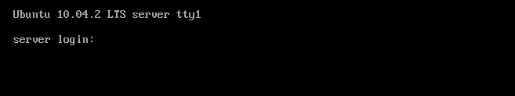

Installation
============

Vorbereitungen
--------------

.. todo:: Andere Installationsmöglichkeiten (Netinstall, USB)

Zur Installation wird eine Installations-CD benötigt.
CD-Images oder `Torrents <http://de.wikipedia.org/wiki/BitTorrent>`_
(empfohlen) zum herunterladen finden sich hier:

http://releases.ubuntu.com/lucid/

Dort bitte die **Server install CD** herunterladen. Es gibt zwei Versionen,
einmal für Prozessoren die **32-Bit** unterstützen (meist ältere Modelle),
und einmal für aktuelle Prozessoren die mit **64-Bit** rechnen. Bei Zweifeln,
welche Architektur der eigene Prozessor unterstützt bitte die 32-Bit Variante
wählen.
Das heruntergeladene CD-Image wird dann mit einem geeigneten Brennprogramm
auf eine CD gebrannt und in das CD-Laufwerk des zukünftigen Servers gelegt.
Um den Server von der CD starten zu lassen, ist es eventuell nötig die
Bootreihenfolge umzustellen (siehe Kasten `Bootreihenfolge ändern
<#bootreihenfolge>`_)

.. _bootreihenfolge:

.. note:: **Bootreihenfolge ändern**

    Damit der Rechner von der Installations-CD startet, muss kurz nach dem
    Einschalten des Rechners ins BIOS (Basic Input Output System) gewechselt
    werden. Das geschieht bei den meisten Rechnern durch drücken der *Entf*,
    oder *F2*-Taste. Welche Taste gedrückt werden muss steht entweder im
    ersten Monitorbild das der Rechner zeigt, oder auch im Handbuch des
    Mainboards. Im BIOS angekommen, müssen die Einstellungen zum Starten des
    Rechners gefunden werden (meist *Startup*, *Boot*, o.ä). Dort kann dann
    die Reihenfolge der Geräte von denen der Rechner ein Betriebssystem laden
    kann bestimmt werden. Je nach Installationsart muss hier das CD-Laufwerk,
    USB-Gerät oder die Netzwerkkarte als ganz oben stehen. Nach der
    Installation kann diese Einstellung wieder Rückgängig gemacht werden,
    bzw. das sollte sie sogar, dazu mehr im Kapitel Sicherheit.

Installation
------------

    Sprachauswahl

    Nach dem Anschalten sollte sich der Bootscreen der CD zeigen und zur 
    Auswahl einer Sprache auffordern. Hier bitte nach persönlichen Vorlieben
    auswählen. In diesem Guide wird mit Deutsch als Auswahl weitergearbeitet.

    Installation starten

    Anschließend wird die erste Option des Menüs ausgewählt um die
    Installation zu starten.

    Installer-Sprache

    Hier wird die Sprache für den Installations-Assistenten ausgewählt.

    Ubuntu kann das zu benutzende Tastaturlayout automatisch durch ein paar
    Fragen auswählen.

.. figure:: images/installation/04-1-tastatur.png
    :align: center
    :alt: Tastaturkonfiguration

    Tastaturkonfiguration

    Hier muss einer der angezeigten Buchstaben eingetippt werden.

    Tastaturkonfiguration
   
    Die Frage ob auf der Tastatur der Buchstabe *ö* vorhanden ist, sollte
    jeder selbstständig beantworten können.

    Tastaturkonfiguration

    Auch hier wieder den angezeigten Buchstaben auf der Tastatur drücken.

    Tastaturkonfiguration

    Diese Frage sollte für ein deutsches Tastaturlayout mit **<Nein>**
    beantwortet werden.

    Tastaturkonfiguration

    Damit ist die Tastatur-Konfiguration abgeschlossen.

.. figure:: images/installation/05-hostname.png
    :align: center
    :alt: Hostname festlegen

    Server Hostname festlegen

    Der Name des Servers ist frei wählbar, sollte aber auf jeden Fall
    eindeutig sein, also nicht mit einem anderen Namen im Netz kollidieren.
    In größeren Netzen kann es auch Sinn machen dem Server einen Namen seiner
    Funktion entsprechend zu geben (z.B. mailserver01)

    Zeitzone auswählen
    
    In der Regel wählt Ubuntu automatisch die richtige Zeitzone aus, man kann
    hier also einfach mit **Ja** die Auswahl annehmen. Falls die Vorgabe nicht
    stimmt kommt man mit **Nein** zu einer Auswahl von Zeitzonen.
    
.. todo:: Partitionierung

    
    Benutzer-Einrichtung

    Nun muss ein neuer Benutzer eingerichtet werden. Dieser wird dazu
    befugt sein Änderungen an der Konfiguration des Systems vorzunehmen und
    zum Beispiel weitere Software installieren.
    Zuerst muss der volle Name des Benutzers eingegeben werden.

    Benutzername

    Im zweiten Schritt wird der Name festgelegt mit dem der Benutzer
    sich anmelden kann. Dieser ist bis auf einige Ausnahmen frei
    wählbar (**root** oder **admin** sind zum Beispiel vom System
    bereits reserviert.

    Passwort festlegen

    Da der Benutzer Administrationsrechte auf dem System hat, sollte ein
    sicheres Passwort gewählt werden. Worte, die zum Beispiel in einem
    Wörterbuch oder Lexikon zu finden sind, sollten vermieden werden. Ideal
    wäre eine Kombination von Groß- und Kleinbuchstaben, Zahlen und
    Sonderzeichen mit einer Mindestlänge von zehn Zeichen.

    Passwort bestätigen

    Zur Sicherheit muss das Passwort noch ein zweites Mal zur Kontrolle
    eingegeben werden.

    Home-Verzeichnis verschlüsseln

    Hier kann die Verschlüsselung des Benutzerverzeichnisses aktiviert werden.
    In der Regel sollte dies auch aktiviert werden, in unserem Fall verzichten
    wir aber zunächst darauf. Also bitte **Nein** wählen.

    Proxy Auswahl

    Falls in Ihrem Netzwerk ein Proxy-Server verwendet wird ist hier dessen
    Adresse einzutragen.

    Automatische Updates konfigurieren

    Ubuntu kann automatisch dafür sorgen, dass wichtige Updates eingespielt
    werden. Diese Funktion wird später von Hand eingerichtet, also hier mit
    **Kein automatischen Aktualisierungen** nicht aktiviert.

.. todo:: Automatische Aktualisierung

    Software-Auswahl

    Diesen Schritt wird übersprungen und die einzelnen Komponenten später
    von Hand eingerichtet. Das hat zum einen einen größeren Lerneffekt, zum
    anderen verliert man bei manueller Installation der Pakete nicht so leicht
    die Übersicht.

    Bootloader installieren

    Damit unser Server Ubuntu von der Festplatte lädt muss ein sogenannter
    Bootloader installiert werden. Dazu wird hier mit **<Ja>** bestätigt.

    Installation abgeschlossen

    Damit ist die Installation beendet und der Rechner kann mit **<Weiter>**
    neu gestartet werden.

    Login-Prompt

    Nachdem Neustart erscheint der Login-Prompt, an dem man sich mit dem,
    während der Installation eingerichteten Benutzer und zugehörigem
    Passwort, anmeldet
